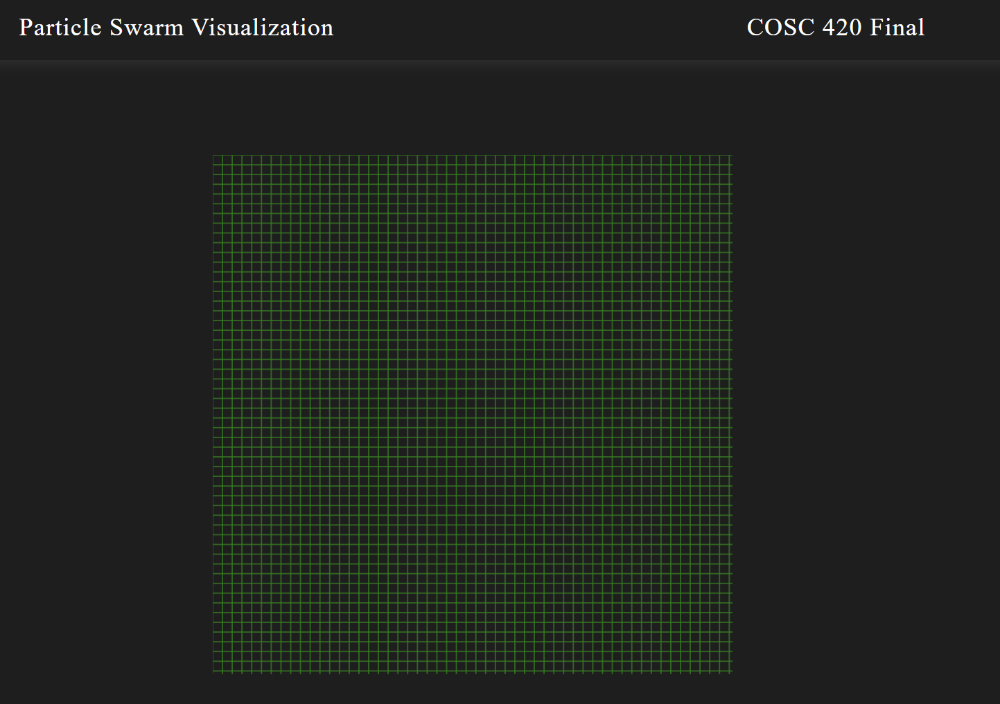

# Running the server
Ensure that Golang is installed to run the server. You can install it [here](https://go.dev/doc/install).

Run `python3 go.py server` or `python go.py server` to run the server.

Once the server is running, you can go to [localhost:8080](http://localhost:8080) to load the page

